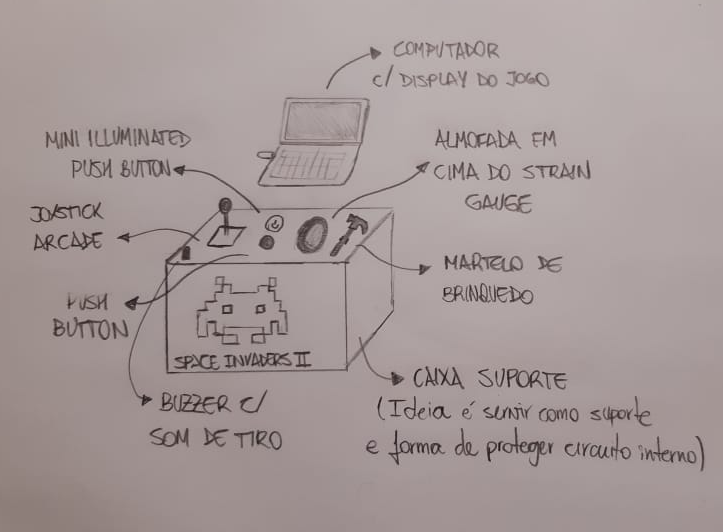

# Projeto Embarcados

Desenvolvendo um controle remoto.

## Entrega 1

### Integrantes

- Gabriel Onishi
- Sarah Pimenta

### Ideia

Controle de Space Invaders com Joystick arcade para movimento e bater um martelo de brinquedo em uma almofada para atirar

### Nome

Space Invaders: Terapia Edition

### Usuários 

Pessoas buscando desestressar e se divertir

### Software/Jogo 

Adaptação de Space Invaders utilizando PyGame

### Jornada do usuários (3 pts)

Cenário 1:
Um aluno de graduação  do Insper está estressado com as provas que estão por vir. Buscando descontrair, ele vai para a feira de Computação Embarcada e se depara com um jogo familiar: Space Invaders. Apesar de ser o mesmo jogo que jogava quando criança, ele repara que há algo de diferente quando vê outros alunos batendo desesperadamente com uma marreta na mesa. Ele decide experimentar e miraculosamente a terapia na base da violência funciona! O aluno acaba o seu jogo menos estressado e mais disposto à voltar aos estudos

Cenário 2:
Um professor da graduação do Insper está chateado com as notas de seus alunos nas provas intermediárias. Depois de passar todo o fim de semana corrigindo avaliações, ele volta para a faculdade na semana seguinte e visita a feira de Computação Embarcada dos alunos do 5° semestre de Engenharia da Computação. Ainda com um pouco de rancor no coração, ele encontra em uma das mesas um cenário inesperado: seus colegas de trabalho batendo desesperadamente com um martelo em uma almofada enquanto controlam um joystick. Ele se aproxima e reconhece a nave e os aliens pixelados - era um jogo da infância. Decide jogar e, depois de apenas alguns minutos imaginando alguns alunos tagarelas na mesa, ele recupera seu bom humor e vontade de lecionar

### Comandos/ Feedbacks (2 pts)

Botão Power: liga e pareia bluetooth (input/output)
Botão Start: inicia o jogo (input)
Joystick Arcade left: anda a nave p/ esquerda (input)
Joystick Arcade right: anda a nave p/ direita (input)
Bater martelo na almofada: atirar (input)
Buzzer: toca música ao acertar o alien (output)

## In/OUT (3 pts)

Para cada Comando/ Feedback do seu controle, associe qual sensores/ atuadores pretende utilizar? Faca em formato de lista, exemplo:

- Movimento da Nave: Joystick Arcade.
Racional: Utilizaremos o sensor apenas para virar pra esquerda e para direita. Se o usuário manter o botão pressionado o personagem continua com o movimento.
- Start Game: Push Button
Racional: Precisamos de uma forma de fazer o usuário começar o jogo. Ao clicar, o jogo executa a função selecionada na tela.
- Pareamento Bluetooth: Mini Illuminated Pushbutton
Racional: Utilizado para começar o pareamento entre o programa em python e o sistema embarcado. Enquanto estiver pareando o botão pisca, quando pareado ele fica ligado
- Sensor pra atirar: Strain Gauge
Racional: Sensor que muda resistência a partir de impacto. Quando a resistência for acima de x (ou abaixo - não vimos as especificações do componente ainda) a nave atira
- Som de atirar: Buzzer
Racional: Feedback de quando o botão efetivamente atira. Faz um som agudo toda vez que a nave atira.

### Design (2 pts)

